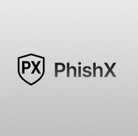

# PhishX - Advanced DNS-based Phishing Protection

<div align="center">
  
  <p>Advanced Phishing Protection powered by OpenPhish and AdGuard</p>
</div>

## 🌟 Features

- **Real-time Protection**: Instant detection and blocking of phishing attempts
- **DNS-level Filtering**: Advanced DNS filtering through AdGuard
- **Detailed Analytics**: Comprehensive dashboard with threat insights
- **Client Management**: Monitor and manage connected devices
- **Custom Rules**: Add and manage custom blocking rules
- **Performance Metrics**: Track DNS query performance and statistics

## 🚀 Tech Stack

- **Framework**: [Next.js 14](https://nextjs.org/)
- **Styling**: [Tailwind CSS](https://tailwindcss.com/)
- **UI Components**: [shadcn/ui](https://ui.shadcn.com/)
- **DNS Management**: [AdGuard Home](https://github.com/AdguardTeam/AdGuardHome)
- **API Integration**: Axios
- **Type Safety**: TypeScript

## 📦 Prerequisites

- Node.js 18.x or later
- AdGuard Home instance running
- Environment variables configured

## 🛠️ Installation

1. Clone the repository:
```bash
git clone https://github.com/yourusername/phishx.git
cd phishx
npm install
```
2. Create a .env file and configure your environment variables:
ADGUARD_URL=your_adguard_home_url
ADGUARD_USERNAME=your_adguard_username
ADGUARD_PASSWORD=your_adguard_password
3. Start the development server:
```bash
npm run dev
```
# Visit URL_ADDRESS:3000/phishx in your browser to access PhishX.

##  📚 Documentation
For detailed documentation about:

- AdGuard Home API
- Next.js
- shadcn/ui
- TypeScript
- Tailwind CSS
- etc.

## 🤝 Contributing
Contributions are welcome! Please feel free to submit a Pull Request.

## 📄 License
This project is licensed under the MIT License.